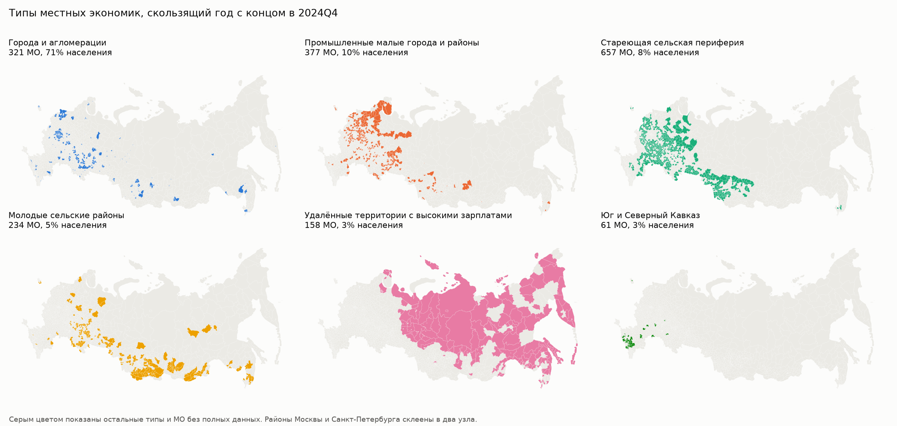

# sberindex-clustering

Решение задачи «Кластеризация» онлайн-конкурса СберИндекс 2026.

- [Методологический отчёт](docs/report.md), он же в [PDF](docs/report.pdf)
- [Презентация](docs/presentation.pdf)
- [Интерактивный атлас](https://yuliavyaznikova.github.io/sberindex-clustering/), исходники в папке `site`

Строим динамическую атрибутированную сеть муниципальных образований (МО) России. Узлы сети это МО, атрибуты узлов это экономические характеристики, рёбра это экономическая близость. Сеть строится для окон «скользящий год» с концом в каждом квартале с конца 2023 по конец 2024 года. Затем МО кластеризуются собственным методом SPECTRA, изменения кластеров отслеживаются во времени, а кластеры описываются как типы местных экономик. Методологический отчёт в [docs/report.md](docs/report.md).

## Метод SPECTRA

Для задачи разработан метод SPECTRA (SPECtral Typology with Refinement for Attributed networks). Он кластеризует атрибутированную сеть МО и прослеживает типы во времени в три шага.

1. Совместная спектральная кластеризация. Граф сходства трат и граф сходства всех 25 признаков объединяются в одну матрицу, вес графа задаётся явно одним параметром (alpha = 0.3).
2. Один шаг уточнения границ. Каждый МО один раз переходит в тип с наименьшей стоимостью по признакам и по связям в сети (критерий KEFRiN, вес графа w = 0.7). Один шаг, а не итерации до сходимости, сохраняет устойчивость спектрального разбиения.
3. Отслеживание во времени. Окна связываются в многослойную сеть, и стоимость в шаге уточнения сглаживается по соседним окнам, поэтому номер типа сохраняет смысл во времени, а пограничные МО не меняют тип туда и обратно.

Отдельные этапы опираются на опубликованные работы (Mucha et al. 2010, Shalileh, Mirkin 2022, Gao et al. 2017), а их сочетание, выбор весов и сглаживание во времени предложены и проверены в этом решении. Среди 83 сравнённых вариантов методов SPECTRA не попадает в худшую треть ни по одному из шести индексов конкурса, и из вариантов без худших третей только она проходит порог устойчивости к составу МО 0.85 (0.90, у лучших вариантов KEFRiN и DMoN 0.82 и 0.59). Подробно в [docs/methods.md](docs/methods.md) и в отчёте.

## Главные результаты

SPECTRA находит шесть устойчивых типов местных экономик.

| Тип | МО | Население | Траты | Зарплата |
|---|---|---|---|---|
| Города и агломерации | 321 | 82 млн | 1.33 | 1.24 |
| Промышленные малые города и районы | 377 | 12.0 млн | 1.02 | 1.02 |
| Стареющая сельская периферия | 657 | 9.5 млн | 0.85 | 0.82 |
| Молодые сельские районы | 234 | 5.4 млн | 0.91 | 0.95 |
| Удалённые территории с высокими зарплатами | 158 | 3.6 млн | 1.17 | 1.57 |
| Юг и Северный Кавказ | 61 | 3.3 млн | 0.90 | 0.76 |

Окно 2024 года, траты и зарплата это медианы к медиане по МО с поправкой на цены.



- **Сеть.** Ребро связывает МО с 10 ближайшими по структуре трат. Это правило выбрано из 11, правила по месячным рядам трат (корреляция роста, лаговая корреляция, DTW) связывают МО с заметно менее похожей местной экономикой (Moran's I признаков труда 0.04-0.23 против 0.30) а их рёбра в соседних окнах совпадают на 0.05-0.23 по Jaccard против 0.53-0.58.
- **Качество.** Среди 83 конфигураций всех методов у SPECTRA нет ни одной худшей трети по шести индексам конкурса (SW, CH, S_Dbw, AVI, AVU, MQ), и из таких конфигураций только она устойчива. k-means она превосходит по четырём индексам из шести, по S_Dbw почти равна ему, а устойчивость почти та же (0.90 против 0.91).
- **Синтетика.** На синтетических данных с известными типами у SPECTRA самый высокий худший случай среди всех методов (ARI 0.53 против 0.43 у k-means).
- **Внешняя проверка.** Типы объясняют пять показателей Росстата, которых не было в модели, лучше деления на регионы, а индекс покупательской мобильности СберИндекса различается между ними с p = 6e-18. Все 65 крупных городов «Четырёх Россий» Н. Зубаревич попадают в тип «Города».
- **Динамика.** За 2024 год тип меняют 7.1% МО, надёжно 35 МО. Доля маркетплейсов на стареющей периферии и Кавказе выше, чем в городах, и разрыв растёт.

## Установка

```
python -m venv .venv
.venv/Scripts/pip install torch==2.14.1 --index-url https://download.pytorch.org/whl/cpu
.venv/Scripts/pip install -r requirements.txt
```

PyTorch нужен только для метода DMoN, достаточно версии для процессора. В Linux и macOS путь к pip `.venv/bin/pip`, без отдельной первой команды pip в Linux поставит PyTorch с CUDA (несколько гигабайт).

## Запуск

```
python run.py download
python run.py features
python run.py compare
python run.py track
python run.py robustness
python run.py describe
python run.py validate
python run.py synthetic
python run.py site
```

| Шаг | Что делает | Результат |
|---|---|---|
| `download` | скачивает пакет данных конкурса (20 МБ) и индекс мобильности | `data/raw` |
| `features` | собирает признаки МО по кварталам и по скользящему году | `data/processed` |
| `compare` | сравнивает правила рёбер и методы кластеризации, около 75 минут | `results` |
| `track` | строит типы МО по окнам и прослеживает их во времени, около 2 минут | `results` |
| `robustness` | проверяет устойчивость типов к параметрам и составу МО, около 50 минут | `results` |
| `describe` | описание типов, изменения, проверка индексом мобильности, расхождение трат и местной экономики, помесячные переходы, маркетплейсы, карты и графики, около минуты | `results`, `results/figures` |
| `validate` | проверяет типы по признакам, сети, мостам между типами, согласию методов, внешним данным Росстата и «Четырём Россиям», считает устойчивость и ранжирование методов, около 20 минут | `results`, `results/figures` |
| `synthetic` | проверяет методы на синтетических данных с известными типами, в том числе когда типы взяты из других методов, около 25 минут | `results`, `results/figures` |
| `site` | собирает данные интерактивного атласа из `results` | `site/data` |

Таблицы Росстата (в том числе показатели для внешней проверки типов), цены по регионам и справочник МО уже лежат в `data/prepared`. Чтобы пересобрать их из первоисточников (ещё около 5 ГБ загрузок), есть `python run.py download --all` и `python run.py prepare`, подробности в [docs/data.md](docs/data.md).

## Тесты

```
python -m pytest
```

Тесты сверяют модулярность с networkx, проверяют AVI, AVU, долю рёбер внутри кластеров и participation coefficient на графах, посчитанных вручную, свойство AVU = 1/3 при трёх кластерах, Moran's I и eta squared по H на данных с известным ответом, нахождение известного сдвига лаговой корреляцией и нулевое расстояние DTW у одинаковых рядов, ранжирование threshold aggregation, воспроизводимость всех совместных методов при одном seed'е, нахождение явных кластеров каждым методом, сохранение типов в многослойной сети на одинаковых окнах, возврат ошибочно отнесённого МО в свой тип шагом уточнения и один тип у МО во всех окнах при полном сглаживании уточнения.

## Документация

- [docs/report.md](docs/report.md) методологический отчёт
- [docs/data.md](docs/data.md) источники данных, лицензии, подготовленные таблицы
- [docs/features.md](docs/features.md) признаки МО
- [docs/network.md](docs/network.md) построение сети и правило рёбер
- [docs/methods.md](docs/methods.md) методы кластеризации
- [docs/metrics.md](docs/metrics.md) метрики качества кластеров
- [docs/dynamics.md](docs/dynamics.md) отслеживание типов во времени
- [docs/economy.md](docs/economy.md) что типы говорят об экономике
- [docs/robustness.md](docs/robustness.md) устойчивость результатов
- [docs/validation.md](docs/validation.md) проверка результатов
- [docs/synthetic.md](docs/synthetic.md) проверка на синтетических данных

## Структура

- `run.py` точка входа
- `config.yaml` источники данных, показатели Росстата, сопоставление названий регионов, параметры сети, модели, сравнения, динамики, проверок и описания типов
- `src/download.py` загрузка исходных данных
- `src/prepare.py` подготовка таблиц Росстата, цен и справочника МО
- `src/features.py` таблица признаков
- `src/network.py` отбор узлов, преобразование признаков, правила рёбер
- `src/kefrin.py` метод KEFRiN
- `src/canus.py` метод CANUS
- `src/dmon.py` метод DMoN
- `src/methods.py` методы кластеризации
- `src/metrics.py` метрики качества кластеров
- `src/compare.py` сравнение правил рёбер и методов
- `src/dynamics.py` отслеживание типов во времени
- `src/robustness.py` проверки устойчивости
- `src/describe.py` описание типов и графики
- `src/economy.py` расхождение трат и экономики, помесячные переходы, маркетплейсы
- `src/validate.py` проверка результатов
- `src/synthetic.py` синтетические данные с известными типами
- `src/site.py` данные интерактивного атласа
- `site` интерактивный атлас, публикуется на GitHub Pages через `.github/workflows/pages.yml`
- `src/api.py` загрузка данных через API СберИндекса
- `src/remote.py` чтение файлов из zip-архива на сервере без скачивания архива
- `tests` тесты
- `data/prepared` подготовленные данные
- `docs` документация

## Лицензия

Код распространяется по лицензии MIT, см. [LICENSE](LICENSE).

Данные в `data` распространяются на условиях их источников. Данные СберИндекса и таблицы, сделанные из них, по CC BY-SA 4.0, данные Росстата в обработке проекта «Точно» по CC BY 4.0. Подробности и ссылки для цитирования в [docs/data.md](docs/data.md).