# Типы местных экономик России

Методологический отчёт, номинация «Кластеризация» онлайн-конкурса СберИндекс 2026. Код и инструкция запуска в [README](../README.md), подробности каждого шага в остальных файлах папки `docs`. Все числа ниже получаются шагами `python run.py ...` и лежат в папке `results`. Презентация решения в [presentation.pdf](presentation.pdf), интерактивный атлас типов по адресу https://yuliavyaznikova.github.io/sberindex-clustering/.

## Главное

- **Сеть.** Узлы это муниципальные образования (МО) в окнах «скользящий год» с конца 2023 по конец 2024 года. Из 2190 МО в данных в сеть окна входят те, у кого есть траты за все месяцы окна, это от 1789 до 1834 МО, всего 1867. У каждого МО 25 признаков в трёх блоках, это потребление, труд и место. Ребро связывает МО с 10 ближайшими по структуре трат. Это правило выбрано из 11, правила по месячным рядам трат, в том числе лаговая корреляция и DTW, связывают МО с заметно менее похожей местной экономикой.
- **Метод SPECTRA.** Для задачи разработан метод SPECTRA (SPECtral Typology with Refinement for Attributed networks). Это совместная спектральная кластеризация графа потребления и графа сходства всех признаков с одним шагом уточнения границ, а во времени многослойная сеть со сглаживанием этого шага. Отдельные этапы опираются на опубликованные работы, их сочетание, веса и сглаживание во времени предложены в этом решении. SPECTRA находит 6 устойчивых типов местных экономик. Среди 83 конфигураций всех методов у неё нет ни одной худшей трети по шести индексам конкурса, и из таких конфигураций только она устойчива. k-means она превосходит по четырём индексам из шести, по S_Dbw почти равна ему и уступает по CH, целевой функции самого k-means.
- **Синтетика.** На синтетических данных с известными типами у SPECTRA самый высокий худший случай среди всех методов (ARI 0.53 против 0.43 у k-means). Значит, она надёжнее остальных, когда неизвестно, какое разбиение ближе к реальности.
- **Динамика.** Изменения прослежены многослойной сетью (Mucha et al. 2010). За 2024 год тип меняют 7.1% МО, надёжно, то есть не меньше чем в половине бутстреп-прогонов, 35 МО.
- **Экономика.** Доля маркетплейсов на стареющей периферии и Кавказе выше, чем в городах, и разрыв растёт, а удалённые территории догоняют быстрее всех. Уровень трат расходится в пользу крупных городов и Кавказа. Пригороды и курорты тратят больше, чем позволяет их местная экономика, вахтовые и добывающие районы меньше.
- **Внешняя проверка.** Типы различаются по данным, которых не было в модели. Это индекс покупательской мобильности СберИндекса (p = 6e-18) и пять показателей Росстата по всей стране (для четырёх p < 1e-57). Все 65 крупных городов «Четырёх Россий» Н. Зубаревич попадают в наш тип «Города».

## 1. Данные и признаки

| Данные | Период | Покрытие | Источник |
|---|---|---|---|
| Безналичные траты жителей на человека в месяц по 6 категориям | янв. 2023 - дек. 2024 | 2190 МО | СберИндекс, пакет данных конкурса |
| Индекс доступности рынков, расстояния между МО по дорогам | 2024 | 2571 МО | СберИндекс, пакет данных конкурса |
| Границы МО и справочник изменений | версии с 2018 | все МО | СберИндекс |
| Численность работников по разделам ОКВЭД2, средняя зарплата | 2023-2024, нарастающим итогом по кварталам | 2186 МО | Росстат, БДПМО (проект «Точно») |
| Население, городское население, возрастная структура, миграция | на 1 января 2023 и 2024, миграция за 2022-2023 | 1917-2190 МО | Росстат, БДПМО |
| Стоимость фиксированного набора товаров и услуг | помесячно 2022-2024 | 85 регионов | ЕМИСС, показатель 31052 |
| Индекс покупательской мобильности (только для проверки) | 2024 | 297 МО Северо-Запада | СберИндекс |

Период 2023-2024 задан данными о тратах. МО связаны с Росстатом по ОКТМО через справочник границ, `territory_id` это МО в постоянных границах. Районы Москвы и Санкт-Петербурга склеены в два узла, потому что это части одного города, где жители живут в одном районе, а работают и тратят в другом. Подробно в [data.md](data.md) и [features.md](features.md).

Признаки описывают местную экономику с трёх сторон.
- **Потребление.** Доли продовольствия, маркетплейсов, транспорта, здоровья, общепита и прочего в тратах и уровень трат к медиане по МО с поправкой на цены региона. Блок показывает, как живут жители.
- **Труд.** Доли работников в 9 укрупнённых отраслях, зарплата к медиане с поправкой на цены и число работников организаций на жителя. Блок показывает, чем МО зарабатывает.
- **Место.** Население, доля горожан, плотность, доли молодых и пожилых, миграция и доступность рынков. Блок описывает размер, демографию и положение МО.

Доли трат переводятся в центрированные логарифмы отношений (Aitchison 1986), доли занятости через квадратный корень, выбросы обрезаются по 1 и 99 процентилям, а блоки получают равный вес.

Нужен каждый блок. Если убрать из атрибутов потребление, типы совпадают с итоговыми только на ARI 0.49, без труда на 0.55, без места на 0.66 (`results/validate_blocks.csv`). Блок «Труд» несёт то, чего нет в графе трат (см. раздел 2). Random forest по исходным признакам восстанавливает тип с accuracy 0.86 на 5-fold кросс-валидации, то есть типы выражаются через понятные признаки (`results/validate_importance.csv`).

## 2. Сеть и правило рёбер

Узел это МО в окне. Атрибуты узла x_i это все 25 признаков. Пусть s_ij это косинусное сходство векторов блока «Потребление» МО i и j, а N_k(i) это k МО с наибольшим s_ij. Ребро (i, j) есть, если j входит в N_k(i) или i входит в N_k(j), его вес max(s_ij, 0), k = 10.

Правило выбрано из одиннадцати на окне 2024 года (`results/edges.csv`, формулы в [network.md](network.md)). Независимая проверка правила это Moran's I признаков труда и места, медиана по блоку. Эти признаки не входят в рёбра ни одного правила, кроме kNN по всем признакам, поэтому высокий Moran's I значит, что правило связывает МО с похожей местной экономикой.

| Правило | Изолированных МО | Рёбер внутри региона | Медиана длины ребра, км | NMI сообществ с регионами | Moran's I труда | Moran's I места |
|---|---|---|---|---|---|---|
| kNN по потреблению, k = 10 | 0 | 14% | 1023 | 0.27 | 0.30 | 0.51 |
| порог по сходству (та же средняя степень) | 267 | 12% | 934 | 0.43 | 0.35 | 0.58 |
| взаимный kNN | 6 | 17% | 899 | 0.31 | 0.31 | 0.54 |
| kNN по всем признакам | 0 | 26% | 654 | 0.33 | 0.72 | 0.82 |
| близость по дорогам | 0 | 79% | 97 | 0.78 | 0.30 | 0.33 |
| гибрид «похожи и рядом» | 0 | 71% | 142 | 0.71 | 0.42 | 0.62 |
| корреляция месячного роста трат | 0 | 12% | 1216 | 0.21 | 0.23 | 0.28 |
| лаговая корреляция роста, сдвиг до 3 месяцев | 0 | 4% | 1655 | 0.13 | 0.04 | 0.07 |
| DTW месячных трат | 0 | 8% | 1476 | 0.17 | 0.13 | 0.19 |

- Порог по сходству рвёт сеть. Густые области пространства признаков получают много рёбер, а редкие ни одного (Maier, von Luxburg, Hein 2009). kNN даёт связный граф с ограниченной степенью.
- Сходство трат почти не зависит от географии. Внутри региона только 14% рёбер, типичное ребро длиной около 1000 км, поэтому сообщества на таком графе это типы, разбросанные по стране, а не регионы. Графы по дорогам и гибридный восстанавливают регионы (NMI 0.71-0.78), то есть описывают экономические районы, а не типы экономик.
- Число соседей задаёт масштаб. При k = 5 Louvain находит 19 сообществ, при k = 20 только 9.
- Moran's I немного выше, чем у kNN по потреблению, при меньшем числе соседей (k = 5 и взаимный kNN, на 0.01-0.03) и заметно выше у трёх правил, которые не подходят по другим причинам. Гибрид добавляет географию и восстанавливает регионы, порог оставляет 267 МО без рёбер, а у kNN по всем признакам труд и место входят в сами рёбра.
- Правила по месячным рядам трат связывают МО с непохожей местной экономикой. Moran's I труда у них 0.04-0.23, места 0.07-0.28 против 0.30 и 0.51 у kNN по потреблению. Лаговая корреляция у 61% рёбер выбирает наибольший разрешённый сдвиг 3 месяца и только у 12% нулевой (`results/edges_lags.csv`). Рёбра соседних окон, у которых 9 из 12 месяцев общие, совпадают у неё на 0.05-0.08 по Jaccard, у DTW на 0.08-0.11, у корреляции роста на 0.21-0.23, у kNN по потреблению на 0.53-0.58 (`results/edges_over_time.csv`). Значит, месячные ряды за год после снятия общей сезонности в основном шум, а найденные опережения неустойчивы, поэтому время учитывается окнами скользящего года и многослойной сетью (раздел 4), а не рёбрами.

Устройство выбранной сети в окне 2024 года (1808 узлов, `results/validate_network.csv`, `results/validate_moran.csv`).
- 11 931 рёбер, одна компонента, степень от 10 до 25 (медиана 13), ассортативность по степени 0.21.
- Коэффициент кластеризации 0.36 против 0.007 у случайного графа с теми же степенями, средний путь 5.5 против 3.2. У сети выраженная локальная структура, это сообщества похожих МО.
- 77% веса рёбер лежит внутри наших типов при 24% у случайного соединения, внутри региона 14% при 2%.
- Сеть трат согласована не только с тратами. Moran's I для населения 0.70, доступности рынков 0.62, плотности и зарплаты 0.60. Отраслевая занятость на ней почти не автокоррелирована (0.09-0.43 по отраслям, медиана блока «Труд» 0.30). Сеть трат знает размер, плотность и доходы МО, но не знает, чем МО зарабатывает, поэтому блок «Труд» в атрибутах добавляет информацию, которой в графе нет.

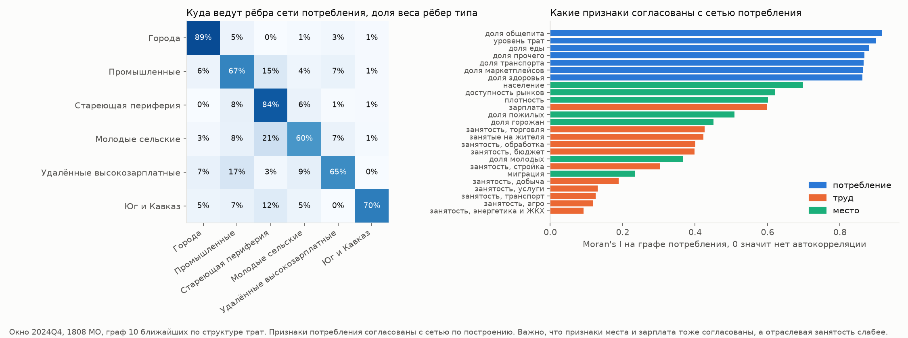

## 3. Методы и выбор модели

### Сравниваемые методы

Сравнивались методы трёх семейств (`results/methods.csv`, подробно в [methods.md](methods.md)).
- Только признаки. Это k-means, Уорд и смесь гауссиан.
- Только граф. Это спектральная кластеризация, Louvain и Leiden.
- Признаки и граф вместе. Это KEFRiN (Shalileh, Mirkin 2022), CANUS (Shalileh 2025), графовая нейросеть DMoN (Tsitsulin et al. 2023), совместная спектральная кластеризация на матрице alpha * W_граф + (1 - alpha) * W_признаки и она же с одним шагом уточнения, это итоговая модель SPECTRA. Все совместные методы написаны по статьям.

Вес графа задан явно одним параметром alpha от 0 до 1 относительно разброса каждого источника. При умолчании авторов KEFRiN (оба веса равны 1) вес графа на наших данных был бы 0.80, и задавала бы его размерность матрицы связей (1808 столбцов против 25 признаков), а не решение исследователя.

### Шаг уточнения

Спектральная кластеризация находит общую структуру affinity matrix, но границы типов проводит грубо, потому что расстояния в пространстве признаков она видит только через граф ближайших соседей. После неё каждый МО один раз переходит в тип с наименьшей стоимостью по критерию KEFRiN (1 - w) ||x_i - c_k||^2 / T_x + w ||p_i - lambda_k||^2 / T_p. Здесь c_k и lambda_k это центры типа в пространстве признаков и в пространстве строк стандартизованного графа потребления, посчитанные по спектральному разбиению, T_x и T_p это полный разброс признаков и графа, w = 0.7.

Это двухэтапная схема с теоретическими гарантиями, то есть начальное разбиение и локальное уточнение (Gao et al. 2017 для стохастической блочной модели, Lu, Zhou 2016 для итераций Ллойда из хорошего старта). Делается один шаг, а не итерации до сходимости. Итерации уводят разбиения разных подвыборок МО в разные локальные оптимумы, и устойчивость падает, а один шаг сохраняет устойчивость спектрального старта. Сам KEFRiN со случайных стартов неустойчив по той же причине, и спектральный старт эту проблему снимает.

### Метрики

Качество оценивалось шестью индексами из критериев конкурса, как рекомендуют Shalileh et al. (ESWA 2026). SW, CH и S_Dbw считаются в пространстве признаков, AVI, AVU (Biswas, Biswas 2017) и MQ (модулярность Q) на графе потребления. Дополнительно считаются доля веса рёбер внутри типов и устойчивость к составу МО, то есть средний ARI разбиения 90% МО с разбиением всех МО. В таблице устойчивость посчитана на 50 подвыборках, общих для всех методов (шаг `validate`). Определения и особенности индексов в [metrics.md](metrics.md).

### Результаты сравнения

Окно 2024 года, k = 6. Для каждого метода показана его лучшая конфигурация по пороговому правилу (см. ниже), для SPECTRA также вариант без шага уточнения.

| Метод | SW | CH | S_Dbw | AVI | MQ | Рёбер внутри типов | Устойчивость |
|---|---|---|---|---|---|---|---|
| k-means | 0.115 | 269 | 0.703 | 0.61 | 0.43 | 62% | 0.91 |
| Уорд | 0.092 | 228 | 0.732 | 0.57 | 0.39 | 59% | 0.44 |
| смесь гауссиан | 0.033 | 177 | 0.747 | 0.46 | 0.25 | 52% | 0.53 |
| спектральная по графу | 0.063 | 189 | 0.760 | 0.86 | 0.68 | 87% | 0.80 |
| Louvain | 0.070 | 172 | 0.764 | 0.88 | 0.67 | 90% | 0.61 |
| Leiden | 0.061 | 183 | 0.779 | 0.88 | 0.69 | 89% | 0.63 |
| KEFRiN, евклид, alpha 0.6 | 0.113 | 267 | 0.705 | 0.66 | 0.47 | 67% | 0.82 |
| KEFRiN, косинус, alpha 0.7 | 0.083 | 224 | 0.689 | 0.79 | 0.63 | 81% | 0.54 |
| CANUS, евклид, alpha 0.6 | 0.081 | 216 | 0.651 | 0.64 | 0.48 | 67% | 0.43 |
| CANUS, косинус, alpha 0.4 | 0.083 | 238 | 0.678 | 0.67 | 0.50 | 69% | 0.69 |
| DMoN, alpha 0.4 | 0.082 | 225 | 0.679 | 0.74 | 0.57 | 74% | 0.59 |
| совместная спектральная без уточнения, alpha 0.3 | 0.114 | 221 | 0.725 | 0.75 | 0.57 | 81% | 0.91 |
| **SPECTRA, совместная спектральная с уточнением, alpha 0.3** | **0.125** | 246 | 0.704 | 0.72 | 0.53 | 77% | 0.90 |

Методы по признакам хороши в пространстве признаков и слабы на графе, методы по графу наоборот. SPECTRA занимает компромисс, недоступный базовым методам. SW, AVI, AVU и MQ у неё лучше, чем у k-means (SW 0.125 против 0.115, MQ на четверть выше, 0.53 против 0.43), S_Dbw почти такой же (0.704 против 0.703), а связей похожих по потреблению МО, разрезанных границами типов, меньше (23% против 38%). Уступает она k-means по CH, целевой функции самого k-means. Шаг уточнения сдвигает совместную спектральную кластеризацию к признакам. SW, CH и S_Dbw становятся заметно лучше (0.125, 246 и 0.704 против 0.114, 221 и 0.725), а MQ и AVI немного ниже (0.53 и 0.72 против 0.57 и 0.75). Устойчивость у SPECTRA почти та же, что у k-means (0.90 против 0.91).

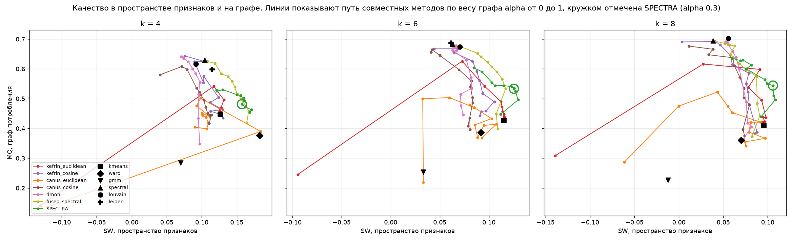

### Ранжирование по шести индексам

Все 83 конфигурации при k = 6 (каждый метод при каждом alpha) оценены пороговым правилом (Aleskerov, Yakuba, Yuzbashev 2007). По каждому индексу конфигурация получает 1, 2 или 3 по третям, выше та, у которой меньше худших оценок, а при равенстве меньше средних (`results/validate_ranking.csv`).
- Без единой худшей трети 13 конфигураций. Это SPECTRA при alpha от 0.1 до 0.9 (9 конфигураций), евклидов KEFRiN при 0.6-0.7 и DMoN при 0.3-0.4.
- Ни у одной из них нет меньше трёх средних оценок. Индексы по признакам и по графу тянут в разные стороны, и лучшие трети каждого индекса держат методы, специализированные на одном пространстве.
- При равенстве по правилу первые места по сумме рангов (Borda) занимает SPECTRA, при alpha 0.2-0.5 у неё 361, 351, 349, 346, и ещё три места при других alpha. Лучший евклидов KEFRiN только восьмой (312).
- Из конфигураций без худших третей, устойчивость которых проверена на 50 подвыборках, порог 0.85 проходит только SPECTRA (0.89 при alpha 0.2, 0.90 при 0.3). У евклидова KEFRiN 0.82 при alpha 0.6, у DMoN 0.59. Шесть индексов не видят устойчивость, поэтому её нужно проверять отдельно.
- Без шага уточнения у совместной спектральной одна худшая треть, по S_Dbw (место 16), у k-means две, по AVI и MQ (место 31).

На наших данных Dens_bw в S_Dbw равна нулю у всех проверенных разбиений. В 25 признаках в шар радиуса stdev вокруг центров кластеров и середин между ними не попадает ни один МО, поэтому S_Dbw здесь совпадает со Scat, средней по кластерам нормой дисперсий без весов по размеру. Она наказывает один большой разнородный кластер, а разбиения с более ровными размерами кластеров получают по ней лучшие оценки.

### Проверка на синтетических данных

Внутренние индексы не говорят, насколько разбиение близко к правильному, поэтому методы проверены на данных, где правильный ответ известен ([synthetic.md](synthetic.md)). Синтетические МО строятся из реальных. Центры шести типов и их размеры берутся из окна 2024 года, разброс внутри типов это остатки реальных МО от центров их типа, перемешанные между МО, а граф строится так же, как в SPECTRA. Без подгонки такие данные похожи на реальные (SW истинного разбиения 0.13, у SPECTRA на реальных данных 0.125).

На 5 наборах средний ARI с истинными типами у SPECTRA 0.67, без шага уточнения 0.62, у KEFRiN 0.57, k-means 0.59, CANUS 0.56, DMoN 0.49, Leiden 0.47, спектральной по графу 0.45. Если у трёх пар типов труд и место одинаковые и они различаются только тратами, разрыв больше (0.77 против 0.65 у k-means). Лучший вес графа на синтетике 0.3-0.5 (0.67 и 0.66).

Эти наборы построены из типов самой SPECTRA и могут давать ей преимущество. Чтобы это проверить, те же сценарии построены ещё из типов k-means и спектральной кластеризации по графу. На данных из типов какого-то метода лучше всех этот метод или близкий к нему. На типах k-means лучше всех k-means и евклидов KEFRiN (у обоих 0.73 против 0.55 у SPECTRA), на типах спектральной по графу сама спектральная (0.63 против 0.53 у SPECTRA). Когда данные построены из типов другого метода, SPECTRA уступает только этому методу и близким к нему, поэтому её худший случай по трём наборам истинных типов самый высокий, 0.53 против 0.52 у следующего метода, 0.43 у k-means и 0.33 у спектральной по графу. В сценарии с парами типов то же самое, 0.48 против 0.45. Значит, SPECTRA надёжнее остальных методов, когда неизвестно, какое разбиение ближе к реальности, а на реальных данных это неизвестно всегда.

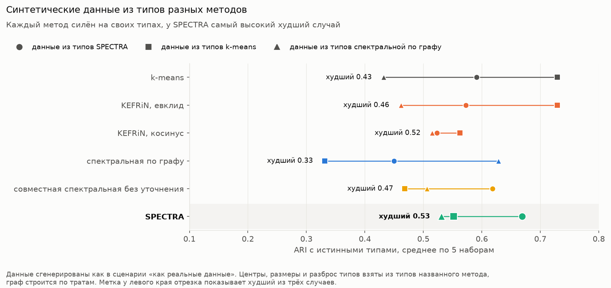

У SPECTRA есть и границы применимости. Если траты не связаны с типом, граф потребления становится шумом, и SPECTRA почти не находит типы (ARI 0.16 против 0.39 у k-means). Такой режим распознаётся без истинных типов по MQ разбиения k-means на графе. В этом сценарии он 0.05, на похожих на реальные синтетических данных 0.50, а на реальных данных 0.43, то есть реальные данные далеки от этого режима. Если шум сильнее в полтора раза, SPECTRA почти равна k-means (0.29 против 0.31). Если граф несёт сильный собственный сигнал, а признаки шумные, вес 0.3 для него мал (0.45, при alpha 0.7 0.63).

Синтетика показывает и свойство самих индексов. На похожих на реальные данных с ARI сильнее всего связаны SW (Спирмен 0.85 по методам), DB (-0.67) и CH (0.66), а AVI и MQ почти не связаны (около 0). В сценариях, где сигнал в графе, наоборот (0.90-0.95). Ни один индекс не указывает на правильный метод во всех режимах, поэтому индексы обоих пространств нужно смотреть вместе.

### Согласие методов

Попарно сравнивается 21 разбиение, это все методы при k = 6, совместные при alpha 0.3 и 0.5 и итоговые типы (`results/validate_methods_ari.csv`). Видны семейства. k-means и евклидов KEFRiN почти совпадают, методы только по графу образуют отдельную группу. В центре ансамбля находится SPECTRA, у неё самый высокий средний ARI с остальными разбиениями (0.53), у итоговых типов 0.52, у k-means и KEFRiN по 0.48. Консенсус по частоте совместного попадания МО в один кластер ближе к методам по признакам, которых в ансамбле больше (ARI консенсуса с евклидовым KEFRiN 0.76, с k-means 0.74, с моделью 0.64).

### Выбор модели

Модель выбрана в два шага. Сначала выбраны вес графа alpha и число типов. Среди конфигураций с устойчивостью не ниже 0.85 и кластером не меньше 3% МО берётся Парето-фронт по (SW, MQ). При k = 6 на нём совместная спектральная кластеризация, и alpha 0.3 даёт у неё самую высокую устойчивость и лучший результат на синтетике. Затем шаг уточнения принят по критерию, записанному до расчётов. Это ни одной худшей трети по шести индексам, устойчивость не ниже 0.85 на 50 подвыборках, ARI на синтетике не ниже, чем без уточнения, и те же по смыслу типы. При k = 6 CANUS, DMoN, Louvain и Leiden порог устойчивости не проходят.

Вес графа в уточнении выбран по таблице `results/validate_refinement.csv` ([validation.md](validation.md)). Вес должен давать разбиение без худших третей и с устойчивостью не ниже, чем без уточнения, а среди таких весов берётся большой вес с запасом до порога худшей трети.
- Худших третей нет при весе от 0.3 до 0.8, устойчивость у всех этих весов 0.90. При весе 0 и 0.9 появляется одна худшая треть.
- С ростом веса растёт MQ (0.49 при весе 0.3, 0.53 при 0.7, 0.56 при 0.8), то есть разбиение сохраняет больше структуры сети. Но S_Dbw при этом подходит к порогу худшей трети, при весе 0.8 он 0.7105 при пороге 0.7109. Выбран вес 0.7, большой и с запасом до порога.
- На синтетике с истинными типами из разных методов вес 0.7 даёт наибольший худший случай в среднем по двум сценариям (0.51), веса от 0.6 до 0.8 здесь почти равны.
- Разбиения при весе от 0.5 до 0.8 почти совпадают (ARI с итоговым разбиением 0.94-0.96), поэтому точное значение веса мало влияет на типы.

Параметры уточнения (вес графа, один шаг, сглаживание во времени) подбирались на сетке. Защитой от подгонки служат проверки, которые в подборе не участвовали, это синтетика, Росстат и бутстреп.

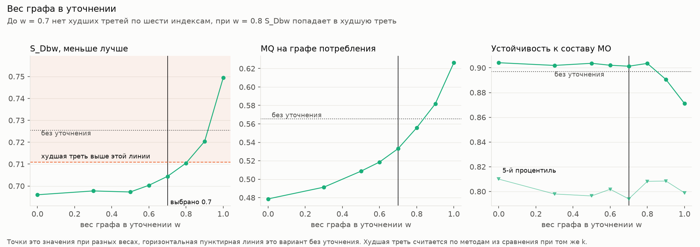

Число типов выбрано по кривой устойчивости (50 общих подвыборок на каждое k). Средний ARI у SPECTRA 0.98 при k = 3, 0.89 при k = 4, 0.79 при k = 5, 0.90 при k = 6, 0.79 при k = 7 и 0.82-0.84 при k от 8 до 10. k = 6 это наибольшее k с устойчивостью выше 0.85 и локальный пик кривой, а при k = 5 и 7 одна из границ между типами неустойчива. При k от 8 до 10 SPECTRA теряет устойчивость медленнее k-means (0.82-0.84 против 0.70-0.76), а у k-means при k = 4 решение двоится (5-й процентиль ARI 0.32).

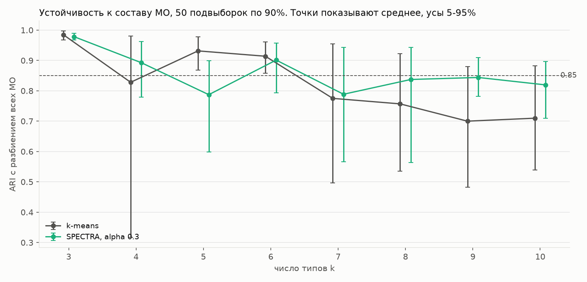

Три свойства индексов важно знать при их чтении.
- AVU при k = 3 равна 1/3 для любого разбиения, при k = 2 всегда 1, потому что знаменатель у всех пар одинаковый.
- У случайного разбиения AVI около 1/k, а AVU = 1/(2k - 3), поэтому разные k нельзя сравнивать по сырым значениям. Мы сравниваем с уровнем случайного разбиения тех же размеров.
- На нашем kNN-графе AVU почти не отличается от случайного уровня ни у одного метода. Она отражает, насколько равномерно внешние связи кластера распределены по остальным, а не силу разделения, поэтому решения на ней не строятся.

## 4. Изменения во времени

**Шаг по времени.** Поквартальные данные для динамики не годятся. Доли трат сезонны, и у разных МО сезонность разная, а данные Росстата нарастающим итогом обнуляются в январе. Между соседними кварталами признаки сдвигаются на 0.23-0.40 стандартного отклонения со скачками на стыке лет. Из-за этого сеть строится по окнам «скользящий год» с концом в каждом квартале (2023Q4 это весь 2023 год, 2024Q4 весь 2024). Росстат пересчитан из нарастающего итога в скользящий год точной формулой. Сдвиг между окнами 0.10-0.14 стандартного отклонения, без скачков ([dynamics.md](dynamics.md)).

**Подход.** Сравнивались пять способов связать окна (`results/dynamics_approaches.csv`).

| Подход | MQ | Сменили тип 2023 -> 2024 |
|---|---|---|
| независимая кластеризация каждого окна и сопоставление | 0.560 | 49% |
| эволюционная, память 0.8 и 0.9 (Chakrabarti et al. 2006) | 0.536 и 0.530 | 29% и 12% |
| AFFECT, адаптивная память (Xu, Kliger, Hero 2014) | 0.546 | 42% |
| фиксированная типология | 0.474 | 16% |
| многослойная сеть, связь 1 (Mucha et al. 2010) | 0.559 | 7% |
| **многослойная сеть, связь 1, и шаг уточнения со сглаживанием 0.3 (SPECTRA)** | **0.526** | **7%** |

Независимая кластеризация перебрасывает половину МО, хотя соседние окна делят 9 месяцев из 12. МО образуют почти непрерывное облако, границы между типами на нём неустойчивы, и без связи во времени изменения сильно преувеличены. Многослойная сеть связывает каждый МО с его копией в соседнем окне (вес связи равен средней силе связей узла внутри окна) и кластеризует все окна сразу. Качество каждого окна остаётся как у независимой кластеризации, а тип сохраняет идентичность без ручного сопоставления.

**Математическая постановка.** Пусть W_t это affinity matrix окна t (t = 1, ..., T, T = 5), нормированная на сумму весов, n_t число МО в окне, N среднее n_t. Многослойная сеть это блочная матрица A, у которой на диагонали стоят W_1, ..., W_T, а вне диагонали стоят связи каждого МО с его копией в соседнем окне, A[(i, t), (i, t + 1)] = A[(i, t + 1), (i, t)] = c / N, c = 1. Средняя сила узла внутри окна равна 1 / N, поэтому c = 1 означает, что связь с прошлым такой же силы, как все связи узла внутри окна. Спектральная кластеризация A на k = 6 кластеров даёт тип каждой пары «МО и окно» сразу во всех окнах, и номер типа сохраняет смысл во времени без сопоставления.

Шаг уточнения во времени работает со стоимостью типа. Для МО i в окне u стоимость типа k равна d_u(i, k) = (1 - w) ||x_iu - c_ku||^2 / T_x + w ||p_iu - lambda_ku||^2 / T_p, центры считаются по типам окна u. Сглаженная стоимость в окне t равна D_t(i, k) = сумма по u s^|t - u| d_u(i, k) / сумма по u s^|t - u|, суммы идут по окнам, в которых есть МО i, s = 0.3. Тип МО в окне t это argmin по k от D_t(i, k).

Изменения описываются тремя величинами.
- Матрица переходов P[a, b] это число МО с типом a в первом окне и типом b в последнем (`results/transitions.csv`).
- Плавность это доля МО, сменивших тип между соседними окнами, и ARI соседних разбиений (`results/dynamics_approaches.csv`).
- Надёжность перехода это доля бутстреп-прогонов, в которых МО тоже сменил тип между первым и последним окном. Прогонов 300, в каждом SPECTRA строится заново на случайных 90% МО, а типы прогона сопоставляются с основным решением венгерским алгоритмом. Переход надёжен, если эта доля не меньше 0.5 (`results/transition_robustness.csv`).

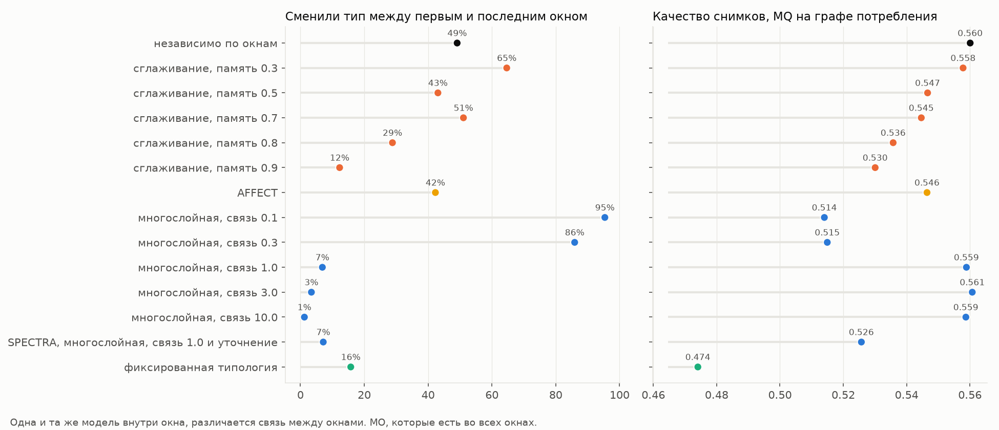

Шаг уточнения SPECTRA применяется к типам каждого окна. Если уточнять окна по отдельности, пограничные МО переходят между типами туда и обратно, поэтому стоимость типа усредняется по окнам с весом 0.3 на соседнее окно и 0.09 на окно через одно. Со сглаживанием доля смен между соседними окнами почти та же, что у многослойной сети (2.3% против 1.9%), а надёжных переходов больше (35 против 28 у варианта без уточнения). Более сильное сглаживание (0.5 и выше) убирает и настоящие переходы.

**Помесячные смены типа в основном отражают сезонность.** Если строить типы по каждому месяцу отдельно, то на 1774 МО с полными рядами в среднем 22% МО меняют тип каждый месяц, с пиками в июне (40%), декабре (38%) и феврале (41%). 44% таких смен откатываются назад в течение двух месяцев, а 82% МО хотя бы раз меняют тип за 23 перехода. Общий для страны сезонный профиль объясняет 59% помесячных колебаний признаков трат внутри МО, а у самих МО сезонный рисунок повторяется из года в год (медианная корреляция 2023 и 2024 годов 0.66). Скользящий год с шагом в месяц даёт 3% смен в месяц и почти без откатов (2%) ([economy.md](economy.md)).

**Переходы.** Тип между 2023 и 2024 годом меняют 126 из 1776 МО, почти всегда в соседний по смыслу тип. Чаще всего стареющая периферия переходит в промышленные (25), молодые сельские районы в периферию (23), молодые сельские в промышленные (11), промышленные в города (10). Надёжных переходов, которые повторяются не меньше чем в половине бутстреп-прогонов, 35 (`results/robust_transitions.csv`).

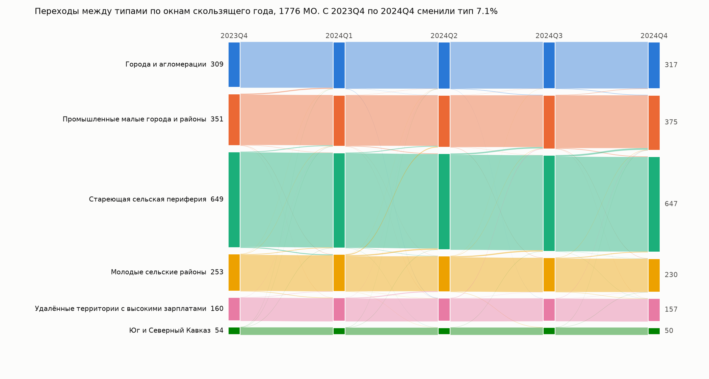

## 5. Что мы узнали об экономике

Шесть типов в окне 2024 года, медианы. Траты и зарплата даны к медиане по МО с поправкой на цены (`results/summary.csv`).

| Тип | МО | Население | Траты | Зарплата | Чем отличается |
|---|---|---|---|---|---|
| Города и агломерации | 321 | 82 млн (71%) | 1.33 | 1.24 | еда 38% трат, общепит 5%, обработка 20% занятых, приток мигрантов |
| Промышленные малые города и районы | 377 | 12.0 млн | 1.02 | 1.02 | обработка 15%, 71% горожан |
| Стареющая сельская периферия | 657 | 9.5 млн | 0.85 | 0.82 | 30% старше трудоспособного возраста, бюджетный сектор 55%, отток, высокая доля маркетплейсов |
| Молодые сельские районы | 234 | 5.4 млн | 0.91 | 0.95 | горожан нет, 21% моложе трудоспособного возраста, много трат на транспорт |
| Удалённые территории с высокими зарплатами | 158 | 3.6 млн | 1.17 | 1.57 | 0.35 работника на жителя, добыча и стройка, самая низкая доступность рынков |
| Юг и Северный Кавказ | 61 | 3.3 млн | 0.90 | 0.76 | 0.10 работника организаций на жителя (неформальная занятость), бюджетный сектор 60% |

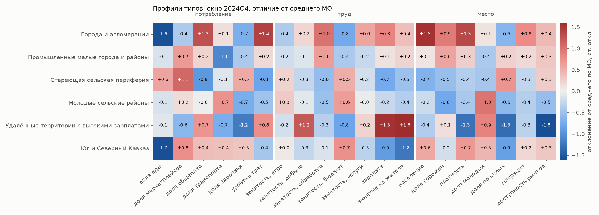

**Динамика 2023-2024.**
- Из шести категорий трат сильнее всего за год изменилась доля маркетплейсов, медиана изменения по МО типа от +3.3 до +4.9 п.п. Доля продовольствия снизилась везде на 1.5-2.1 п.п., доля прочих трат на 1.7-2.2 п.п., а доли транспорта, здоровья и общепита изменились меньше чем на 0.6 п.п. (`results/changes.csv`), поэтому маркетплейсы разобраны отдельно.
- Доля маркетплейсов выросла во всех типах, на 3.5 п.п. в городах и на 5.0 на стареющей периферии по медианной доле типа за год, в рублях на 52-91%, с пиками распродаж в ноябре. Периферия не догоняет города. На стареющей периферии доля маркетплейсов уже в 2023 году была в 1.20 раза выше, чем в городах, к 2024 стала в 1.26 раза выше, на Кавказе в 1.37 раза. Догоняют только удалённые территории (0.63 -> 0.78 от уровня городов, траты на маркетплейсах в рублях выросли в 1.91 раза) и молодые сельские районы, которые обогнали города в середине 2024 года.
- Уровень трат относительно медианного МО вырос в городах (+1.8%) и на Кавказе (+2.6%) и снизился в остальных типах (на 0.6-1.9%), то есть по уровню трат разрыв растёт.
- Надёжные смены типа (35 МО) чаще всего ведут в «промышленные малые города и районы» (18 МО, в основном из молодых сельских районов и стареющей периферии). Перешедшие в «города и агломерации» лежат ближе к региональным центрам (6 МО, медиана 60 км до ближайшей столицы региона при 107 км у всех МО, например Большой Камень у Владивостока и Чапаевск у Самары), а перешедшие в «стареющую периферию» дальше (4 МО, медиана 132 км). Направление похоже на стягивание к агломерациям, но выборки очень маленькие, поэтому это наблюдение, а не закономерность.

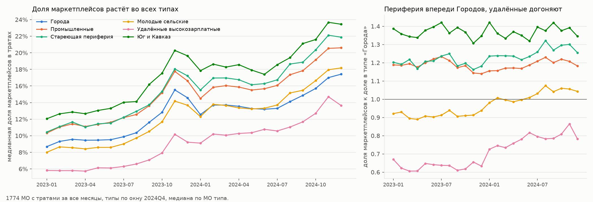

**Где траты не следуют за экономикой.** Траты в данных СберИндекса относятся к жителям МО, а занятость и зарплата Росстата к месту работы. Уровень трат МО предсказан по 18 признакам труда и места градиентным бустингом, out-of-fold R² = 0.78. Отклонение от прогноза это устойчивое свойство территории, его ранговая корреляция между 2023 и 2024 годами 0.85 (`results/spending_gap.csv`, `results/spending_gap_summary.csv`). Больше прогноза тратят пригороды региональных центров (Псковский, Иркутский, Благовещенский районы), курорты (Зеленоградский, Светлогорский) и гарнизоны (Тоцкий район), где люди зарабатывают в другом месте, а тратят дома. Меньше тратят районы добычи и вахты (Нижневартовский, Радужный) и северные районы с высокой зарплатой.

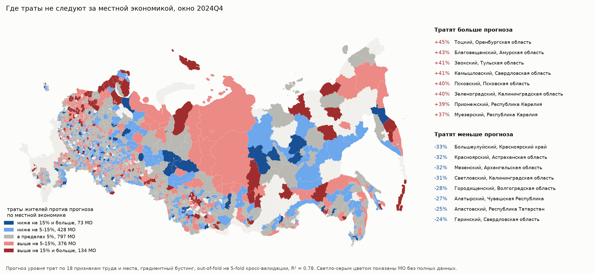

**Сопоставление с «Четырьмя Россиями» Н. Зубаревич.** Схема переведена в правило для МО. Россия 1 это города от 250 тыс. жителей, Россия 2 города от 20 до 250 тыс., Россия 4 республики Северного Кавказа, Тыва и Алтай, Россия 3 всё остальное. V Крамера 0.50. Все 65 крупных городов попадают в наш тип «Города», Россия 4 на 54% в «Юг и Кавказ». Третью Россию наши типы делят на четыре разных, это стареющая периферия (47%), промышленные (20%), молодые сельские (15%) и удалённые высокозарплатные (10%). Ещё 84 МО третьей России с 8.2 млн жителей по тратам живут как города. Это пригороды агломераций, граница которых видна по поведению, а не по статусу.

**Как описать типы словами.** Каждый тип можно описать двумя-тремя пороговыми условиями на исходных признаках, если пороги задавать процентилями внутри окна (`results/type_rules.csv`). Абсолютные пороги не работают, потому что доля маркетплейсов за год выросла на 4-5 п.п.
- Города. Траты в верхних 30% МО, доля транспорта в верхней половине, плотность не в нижних 40% (precision 0.88, recall 0.91).
- Стареющая периферия. Доля общепита в нижних 40%, и МО не входит в 10% самых удалённых по доступности рынков (precision 0.79, recall 0.84).
- Удалённые территории. Плотность в нижних 40%, доля прочих трат в верхних 40%, зарплата в верхних 30% (precision 0.88, recall 0.71).
- Юг и Кавказ. Доля еды в нижних 30%, доля здоровья в верхних 20%, зарплата в нижней половине (precision 0.78, recall 0.74).
- Хуже всего правилами описываются промышленные (F1 0.66) и молодые сельские районы (0.60). Те же правила на окне 2023 года сохраняют precision 0.58-0.91, то есть описывают тип, а не год.

**Типы не складываются в иерархию.** Если строить 3, 4 или 5 типов, большинство наших типов почти целиком входят в один из них, а «Промышленные малые города и районы» делятся между периферией, городами и удалёнными территориями (`results/type_hierarchy.csv`, доля МО-окон в своём укрупнённом типе 0.80-0.82). Это переходный тип. По средней силе связей ближе всего друг к другу стареющая периферия и молодые сельские, периферия и промышленные, города и промышленные, молодые сельские и удалённые. Города не связаны с периферией, удалённые с Кавказом.

## 6. Почему этому можно доверять

- **Внешняя проверка на Северо-Западе.** Индекс покупательской мобильности СберИндекса, то есть медианное расстояние до мест покупок, не входил в модель. На Северо-Западе он сильно различается между типами (H = 86.8, p = 6e-18). Это 4.0 км в городах, 0.70 км в промышленных, 0.90 км в молодых сельских районах и 0.43 км на стареющей периферии (`results/mobility_check.csv`).
- **Внешняя проверка по всей стране.** Пять показателей Росстата, не входивших в модель, различаются между типами. Это оборот розничной торговли на жителя (H = 722, p = 7e-154, медиана 185 тыс. руб. в городах и 71 тыс. на стареющей периферии), оборот общепита (p = 3e-73), ввод жилья (p = 2e-58, 621 кв. м на 1000 жителей в городах и 212 на периферии), инвестиции на жителя (p = 6e-94, 206 тыс. руб. в удалённых высокозарплатных) и места в гостиницах (p = 0.001). Типы объясняют эти показатели лучше, чем деление на регионы (eta squared по H с поправкой на число групп 0.24 против 0.23 в среднем по пяти), и лучше, чем вариант без шага уточнения (0.22). По уровневым показателям (розница, общепит, инвестиции) k-means объясняет их немного лучше (0.25 в среднем), а SPECTRA лучше по вводу жилья и местам в гостиницах. Это цена учёта сетевой структуры трат (`results/validate_external.csv`).
- **Бутстреп.** Модель пересчитана 300 раз на случайных 90% МО (`results/confidence.csv`). По всем окнам медианная уверенность принадлежности к типу 0.94, у 57% пар «МО и окно» она не ниже 0.9. В окне 2024 года самые уверенные типы это города (93% МО с уверенностью от 0.9) и Кавказ (87%), наименее уверенный это стареющая периферия (40%), к ней примыкают пограничные МО.
- **Смены типа происходят на границах.** Среди МО с уверенностью ниже 0.7 тип за год сменили 31%, среди МО с уверенностью от 0.9 только 0.4%. Уверенность отделяет сменивших тип с AUC 0.91, доля рёбер МО, ведущих в чужие типы по графу 2023 года, с AUC 0.74. Это проверка согласованности, а не прогноз, потому что SPECTRA видела оба года.
- **Согласие методов.** Для каждого МО посчитано, в какой доле из 20 разбиений других методов он оказывается вместе с соседями по своему типу. Эта мера согласуется с бутстреп-уверенностью (Спирмен 0.79), то есть две независимые оценки надёжности указывают на одни и те же пограничные МО.
- **Равные условия сравнения.** Все методы получали одни и те же входы и одни и те же подвыборки, параметры DMoN и CANUS взяты из статей. Оценка устойчивости по 5 подвыборкам шумная (до 0.2 между прогонами), поэтому ключевые сравнения сделаны на 50 общих подвыборках. По устойчивости SPECTRA почти равна k-means (0.90 и 0.91), её преимущество в качестве разбиения.
- **Чувствительность.** На сетке из 72 конфигураций (10 или 15 соседей, вес графа 0.2-0.4, 5-7 типов, связь 0.5-3) доля МО, сменивших тип за год, при связи 1 лежит в пределах 5-10%. При 10 соседях типология устойчива к силе связи (ARI с основным решением 0.77-1.0), при 15 соседях отличается сильнее (0.59-0.84). К весу графа она чувствительна, при 0.2 решение определяется почти одними признаками (ARI 0.41-0.44) (`results/sensitivity.csv`, [robustness.md](robustness.md)).
- **Проверка метрик и кода.** Модулярность сверена с networkx, формулы AVI и AVU с первоисточником. Найденные свойства индексов (AVU = 1/3 при k = 3, зависимость от k, вырождение S_Dbw в Scat) учтены при выборе. В репозитории 26 автоматических тестов (`python -m pytest`). Они проверяют метрики на графах, посчитанных вручную, лаговую корреляцию и DTW на рядах с известным сдвигом, воспроизводимость всех совместных методов при одном seed, нахождение явных кластеров каждым методом, шаг уточнения и его сглаживание во времени.

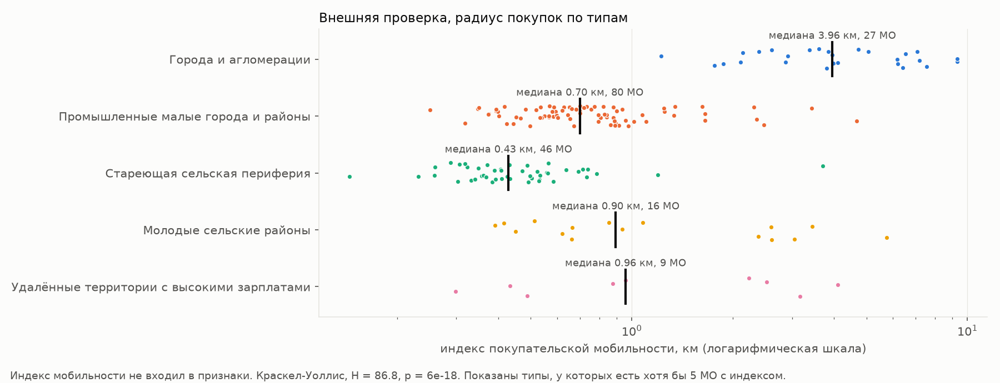

## 7. Как этим пользоваться

- `results/types.csv` содержит тип каждого МО в каждом окне, `results/confidence.csv` уверенность, `results/robust_transitions.csv` надёжные смены типа. Их можно использовать как готовую типологию для сравнения МО с похожими, для выбора контрольных групп при оценке программ и для мониторинга. МО, надёжно сменивший тип, это повод для разбора.
- Модель обновляется при выходе новых данных. `python run.py features` и `python run.py track` пересчитывают окна и типы с сохранением их идентичности во времени. Параметры (вес графа, вес графа в уточнении, число типов, сила связи, сглаживание) задаются в `config.yaml`.
- Код открыт (MIT), данные выложены с указанием лицензий, весь расчёт воспроизводится шагами из [README](../README.md).

## 8. Ограничения

- Данные о тратах есть только за 2023-2024 годы, поэтому видна динамика одного года, а не долгосрочные траектории.
- Росстат не учитывает малое предпринимательство, а у части МО отрасли засекречены (в среднем 10% работников без раскрытой отрасли).
- Возрастной структуры нет у районов Санкт-Петербурга, миграции за 2024 год нет совсем, взято среднее за 2022-2023 годы.
- Индекс мобильности есть только для Северо-Запада, поэтому эта внешняя проверка региональная.
- Типы лежат на непрерывном спектре МО. Пограничные МО (уверенность ниже 0.7 у 17%) стоит трактовать как смешанные.

## Литература

- Aitchison J. The Statistical Analysis of Compositional Data. Chapman and Hall, 1986.
- Aleskerov F., Yakuba V., Yuzbashev D. A 'threshold aggregation' of three-graded rankings. Mathematical Social Sciences, 53(1), 106-110, 2007.
- Ben-Hur A., Elisseeff A., Guyon I. A stability based method for discovering structure in clustered data. Pacific Symposium on Biocomputing, 2002.
- Biswas A., Biswas B. Defining quality metrics for graph clustering evaluation. Expert Systems with Applications, 71, 2017.
- Chakrabarti D., Kumar R., Tomkins A. Evolutionary clustering. KDD, 2006.
- Gao C., Ma Z., Zhang A. Y., Zhou H. H. Achieving optimal misclassification proportion in stochastic block models. Journal of Machine Learning Research, 18(60), 2017.
- Guimerà R., Amaral L. A. N. Functional cartography of complex metabolic networks. Nature, 433, 2005.
- Halkidi M., Vazirgiannis M. Clustering validity assessment: finding the optimal partitioning of a data set. ICDM, 2001.
- Lu Y., Zhou H. H. Statistical and computational guarantees of Lloyd's algorithm and its variants. arXiv:1612.02099, 2016.
- Maier M., von Luxburg U., Hein M. Influence of graph construction on graph-based clustering measures. NeurIPS 21, 2009.
- Moran P. A. P. Notes on continuous stochastic phenomena. Biometrika, 37, 1950.
- Mucha P. J. et al. Community structure in time-dependent, multiscale, and multiplex networks. Science, 328, 2010.
- Newman M. E. J., Girvan M. Finding and evaluating community structure in networks. Physical Review E, 69, 2004.
- Rousseeuw P. J. Silhouettes. Journal of Computational and Applied Mathematics, 20, 1987.
- Sakoe H., Chiba S. Dynamic programming algorithm optimization for spoken word recognition. IEEE Transactions on Acoustics, Speech, and Signal Processing, 26(1), 1978.
- Shalileh S., Mirkin B. Community partitioning over feature-rich networks using an extended k-means method. Entropy, 24(5), 2022.
- Shalileh S. A filtered gradient descent clustering method to recover communities in attributed networks. IEEE Access, 13, 2025.
- Shalileh S., Antonov E., Tsyplakova D. Internal cluster validity indices for attributed networks: a controlled comparative study. Expert Systems with Applications, 2026.
- Traag V. A., Waltman L., van Eck N. J. From Louvain to Leiden: guaranteeing well-connected communities. Scientific Reports, 9, 5233, 2019.
- Tsitsulin A., Palowitch J., Perozzi B., Müller E. Graph clustering with graph neural networks. Journal of Machine Learning Research, 24(127), 2023.
- von Luxburg U. Clustering stability: an overview. Foundations and Trends in Machine Learning, 2(3), 2010.
- Xu K. S., Kliger M., Hero A. O. Adaptive evolutionary clustering. Data Mining and Knowledge Discovery, 28, 2014.
- Зубаревич Н. В. Четыре России. Ведомости, 30.12.2011.